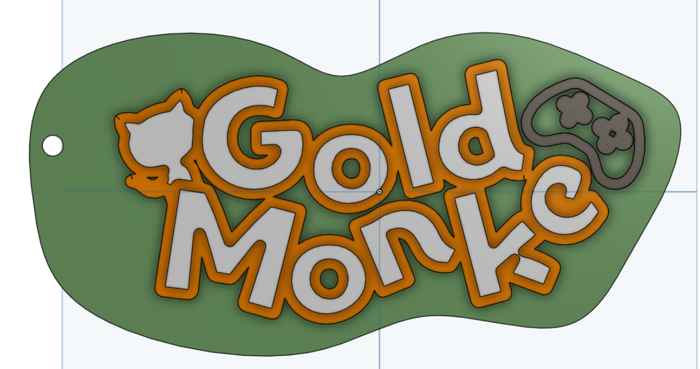
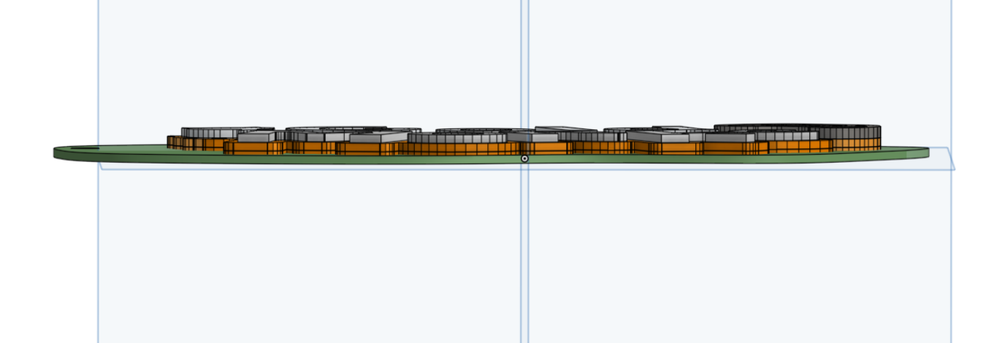

# GoldMonke's Keychain

This is the keychain I made for Hackclub Summer Camp

I made it using figma for designing the keychain and then making the cad model with onshape.

The keychain.step file is supposed to ~look like this: 

Top:

Side (Front):

